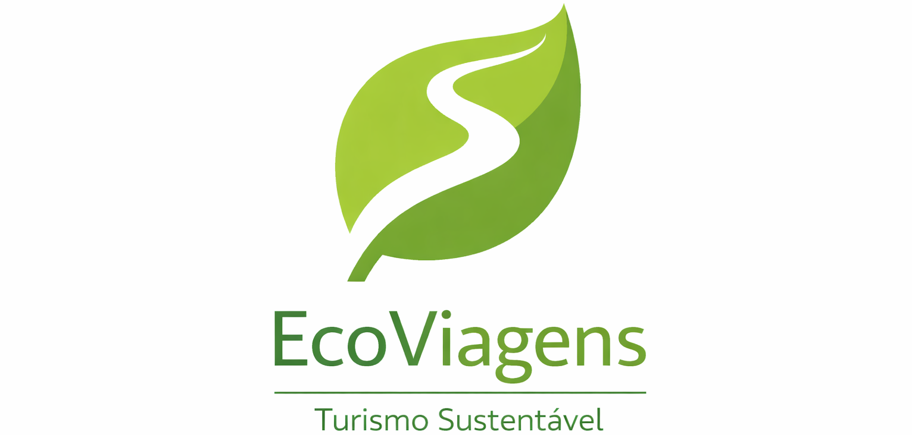

<p align="center">
  
</p>

## Contexto do Projeto

A EcoViagens é uma plataforma brasileira de turismo sustentável, dedicada à oferta de experiências ecológicas em parceria com operadores locais. Seu objetivo é promover práticas que gerem impacto positivo tanto para o meio ambiente quanto para as comunidades envolvidas. A base de dados disponível contempla diferentes dimensões e métricas, incluindo informações sobre reservas, operadores, atividades e indicadores relacionados à sustentabilidade.

Neste contexto, o presente projeto utiliza um conjunto de dados com o objetivo de analisar e avaliar o desempenho da EcoViagens no período de junho de 2024 a junho de 2025 (mês parcial). A análise busca gerar insights relevantes para o monitoramento da performance da plataforma, apoiando a tomada de decisões estratégicas.

A seguir, são apresentadas as seguintes perguntas de negócio:
1. Análise de desempenho da receita: Como a receita está evoluindo ao longo do tempo?
2. Análise por tipo de oferta: Qual tipo de oferta gera melhor desempenho, atividades ou hospedagens?
3. Análise das práticas sustentáveis: As práticas sustentáveis impactam na receita?
4. Análise de operadores: Quais operadores geram maior receita?
5. Análise das práticas sustentáveis e desempenho: Quais práticas sustentáveis estão associadas ao maior número de reservas e melhores avaliações?
6. Análise da satisfação dos clientes: Como está a satisfação média dos clientes e por tipo de oferta?
7. Análise de fidelização: Como está o comportamento de retorno dos clientes?
8. Análise dos fatores que impactam a receita: Quais fatores estão associados à variação da receita ao longo do tempo?

## Modelagem dos Dados

A modelagem dos dados foi desenvolvida com o objetivo de estruturar e organizar as informações de forma consistente, por meio de um Diagrama de Entidade-Relacionamento (DER). O modelo foi construído considerando as principais entidades do negócio e seus relacionamentos.

As principais entidades contempladas no modelo incluem:

- Ofertas
- Reservas
- Práticas Sustentáveis
- Avaliações
- Clientes
- Operadores

Essa estrutura permite consultas eficientes em SQL e oferece suporte à construção de dashboards analíticos no Power BI.


**Componentes Principais dos Dados**

O modelo foi organizado a partir dos seguintes grupos de informações:

- **Informações de Reservas:** identificadores únicos, datas, quantidade de reservas e status (confirmada, cancelada, etc.);
- **Dados de Operadores:** informações sobre empresas ou guias responsáveis pelas experiências;
- **Ofertas:** identificador da oferta, tipo de experiência e preço;
- **Dados de Clientes:** nome, e-mail, data de nascimento e localização;
- **Avaliações:** notas atribuídas pelos clientes, comentários e data da avaliação;
- **Práticas Sustentáveis:** classificação das práticas adotadas, como conservação ambiental, apoio à comunidade local, entre outras.

## Análise dos Dados via SQL

Com os dados estruturados em um ambiente relacional, foram desenvolvidas consultas SQL analíticas com o objetivo de responder às principais questões de negócio da plataforma EcoViagens. Entre as análises realizadas, destacam-se:

- Como evolui o volume de reservas ao longo do tempo?
- Quais períodos apresentam maior concentração de demanda?
- Como se comporta o desempenho das ofertas e experiências?
- Existem padrões relevantes no comportamento dos usuários?

As análises foram realizadas utilizando o Google BigQuery, devido à sua alta escalabilidade e desempenho no processamento de grandes volumes de dados.

**Exemplo de análise: Receita por período**<br>
```sql
SELECT
  EXTRACT(YEAR FROM data_reserva) AS ano,
  EXTRACT(MONTH FROM data_reserva) AS mes,
  FORMAT_DATE('%b', DATE(data_reserva)) AS mes_abrev,
  COUNT(*) AS qtd_reservas
FROM `ecoviagens-484814.plataforma.reservas`
WHERE UPPER(status) = 'CONCLUÍDA'
GROUP BY 
  ano, mes, mes_abrev
ORDER BY 
  ano ASC, mes ASC;
```
As consultas SQL utilizadas neste projeto estão disponíveis [aqui](https://github.com/caroline15calandrine-cell/Projeto-EcoViagens/blob/main/2.%20An%C3%A1lise-sql/Ecoviagens.sql).

## Dashboard de Desempenho da Plataforma

Este projeto conta com um dashboard interativo desenvolvido no Power BI, com o objetivo de analisar e monitorar o desempenho da plataforma de turismo sustentável EcoViagens.

Visualizações:

- Evolução das receitas e do volume de reservas ao longo do tempo
- Distribuição das reservas e ticket médio por tipo de oferta
- Análise da avaliação dos clientes ao longo do tempo e por tipo de oferta
- Comparação entre a receita gerada e a popularidade das práticas sustentáveis

Indicadores monitorados:

- Taxa de fidelização
- Taxa de cancelamento
- Total de reservas concluídas
- Receita total
- Ticket médio
- Avaliação média dos clientes

O painel foi estruturado para apoiar a tomada de decisão, permitindo identificar padrões de comportamento, oportunidades de melhoria e o impacto das práticas sustentáveis no desempenho da plataforma. O relatório pode ser visualizado abaixo:


Insights do Dashboard:

- Receita: a receita oscila ao longo do tempo, sem crescimento contínuo. O valor mais baixo no último mês pode estar relacionado ao fato de ser um mês parcial.

- Reservas: o volume de reservas apresenta variações ao longo do período, com redução no final. O comportamento não é estável ao longo do tempo.

- Avaliação: a avaliação média se mantém próxima de 3 ao longo do período. Não há melhora significativa nas notas dos clientes.

- Fidelização: a taxa de fidelização é baixa. Não há crescimento consistente ao longo do tempo.

- Sustentabilidade: a maior parte das reservas está concentrada em ofertas com práticas sustentáveis. Não se observa um padrão claro entre práticas sustentáveis e receita.

## Conclusão & Recomendações

A análise dos dados mostra que a EcoViagens ainda enfrenta oscilações importantes. A variação constante na receita e nas reservas dificulta a previsão do faturamento para os próximos meses.
Além disso, o baixo número de clientes que voltam a comprar e a nota média de satisfação indicam que a experiência do usuário precisa melhorar. Hoje, a plataforma depende muito entrada de novos usuários para continuar crescendo, de focar na retenção de quem já conhece a marca.. Outro ponto de atenção: as práticas sustentáveis atraem muitas reservas, mas ainda não estão se traduzindo em um aumento real no lucro, o que sugere que esse diferencial pode ser melhor explorado estrategicamente.

Nesse sentido, é importante ressaltar que, para melhorar o desempenho da plataforma EcoViagens e potencializar seus resultados, diversas estratégias podem ser implementadas:

  1. **Otimização da Demanda ao Longo do Tempo**: implementar campanhas promocionais em períodos de baixa demanda, visando equilibrar o volume de reservas ao longo do tempo e aumentar a receita
  
  2. **Redução da Taxa de Cancelamento**: revisar políticas de cancelamento e melhorar a comunicação com os clientes no pré-serviço, reduzindo incertezas e aumentando a retenção de reservas
  
  3. **Melhoria da Experiência do Cliente**: monitorar continuamente o desempenho dos operadores com base nas avaliações e implementar programas de melhoria para aqueles com desempenho abaixo da média
  
  4. **Incentivo às Práticas Sustentáveis:** criar mecanismos de incentivo, como maior visibilidade na plataforma ou benefícios para operadores que adotam práticas sustentáveis, pode aumentar o engajamento com a proposta ecológica da EcoViagens

Além das recomendações apresentadas, é fundamental que a plataforma esteja atenta às mudanças no comportamento dos consumidores e às tendências do mercado de turismo sustentável.
