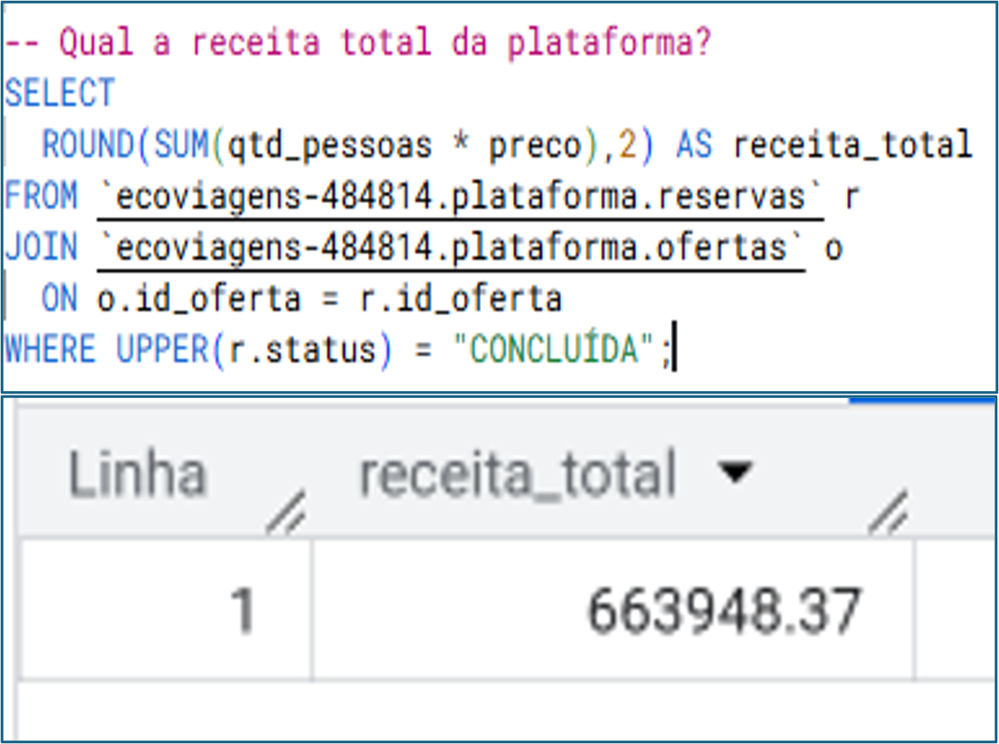
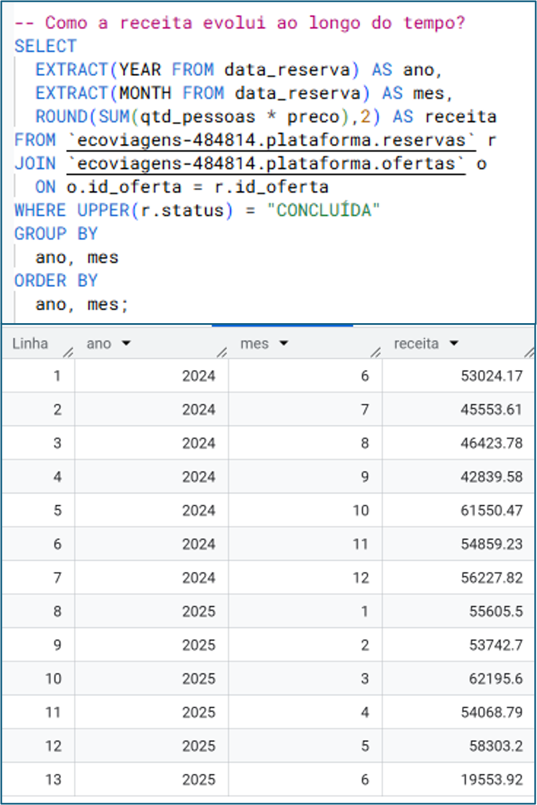
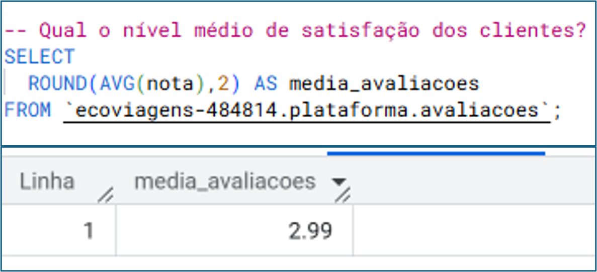
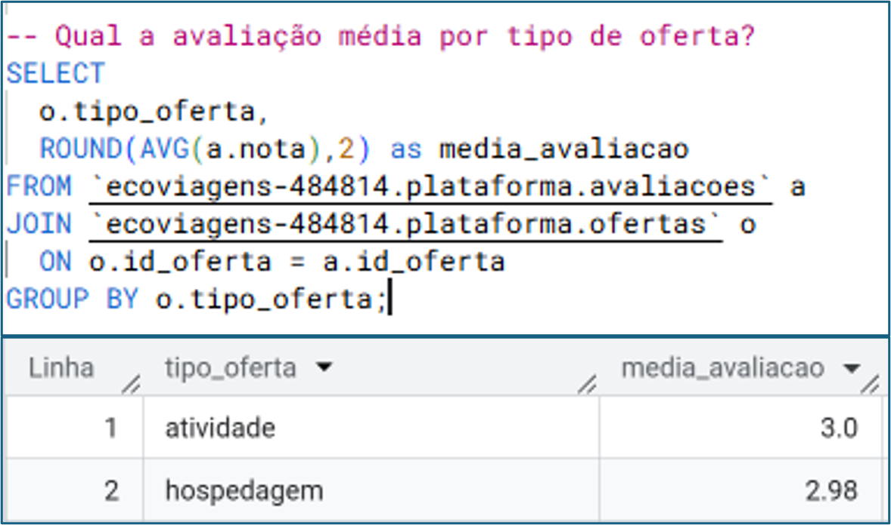

## Análise os dados da plataforma EcoViagens
Foram realizadas análises em SQL com o objetivo de explorar os dados da plataforma EcoViagens e compreender seu desempenho sob diferentes perspectivas.

### Análise por Reservas
Inicialmente, foi identificada a quantidade total de reservas concluídas na plataforma.

* imagem

Em seguida, foi analisada a evolução do volume de reservas ao longo dos meses, considerando apenas reservas com status "concluída".

  

Os resultados mostram que o mês de outubro de 2024 apresentou o maior volume, com 82 reservas, seguido por janeiro de 2025, com 72 reservas. Esse comportamento pode indicar a presença de sazonalidade na demanda, possivelmente relacionada a períodos de maior procura por viagens.

# Análise por Práticas Sustentáveis
As práticas sustentáveis podem desempenhar um papel relevante na decisão dos clientes. Nesse contexto, foi analisado o volume de reservas associado a cada prática.
Os resultados indicam que o "Plantio de árvores nativas" foi a prática mais presente, com 47 reservas, seguido por "Compostagem de resíduos orgânicos" e "Economia circular", ambas com 43 reservas.

  

Também foi realizada uma análise comparando reservas com e sem práticas sustentáveis. Observou-se que as reservas com práticas sustentáveis são superiores às sem essas práticas, sugerindo uma possível preferência dos clientes por opções com menor impacto ambiental.

  

Esse resultado reforça a importância de estratégias voltadas à sustentabilidade como diferencial competitivo.

# Análise por Receita 
Foi calculada a receita bruta da plataforma a partir da multiplicação do número de pessoas por reserva pelo preço da oferta (SUM(qtd_pessoas * preco)), considerando apenas reservas concluídas.

  

A análise ao longo do tempo mostra que março de 2025 apresentou a maior receita, com R$ 62.195,60. Em contrapartida, junho de 2025 apresentou uma queda acentuada, possivelmente por se tratar de um período ainda em andamento, caracterizando dados parciais.

  

Esse comportamento indica variações importantes na receita, que podem estar associadas ao volume de reservas ou a fatores sazonais.

## Análise por Avaliação
### Media Avaliação
A avaliação média dos clientes foi analisada com base em notas de 1 a 5.

  

Além da média geral, foi realizada uma segmentação por tipo de oferta:
- Hospedagem (acomodaçoes com práticas sustentáveis)
- Atividade (experiências e passeios sustentáveis)

  

Os resultados indicam um equilíbrio entre os dois tipos de oferta, embora haja uma leve predominância de reservas relacionadas à hospedagem.
A análise sugere a necessidade de aprofundamento na experiência do cliente, especialmente considerando oportunidades de melhoria na qualidade percebida dos serviços.

